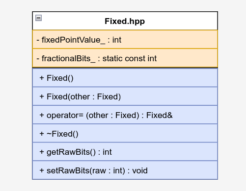
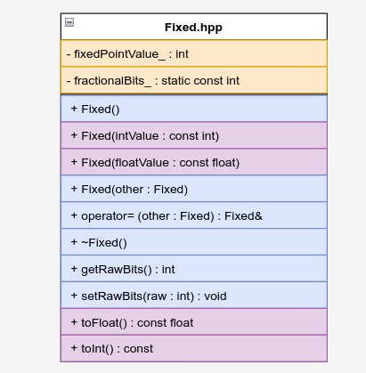

# 🔢 C++ Module 02 - Fixed-Point Numbers and Operators

This module introduces operator overloading, copy constructors, assignment operators, and the implementation of fixed-point arithmetic for precise decimal calculations.

## 🎯 Learning Objectives

- Master operator overloading in C++
- Understand copy constructors and assignment operators
- Learn about the canonical form of classes
- Implement fixed-point arithmetic
- Practice with const correctness
- Understand binary point arithmetic

## 📁 Exercises Overview

### Exercise 00: Fixed-Point Class Basics
**Files**: `Fixed.hpp`, `Fixed.cpp`, `main.cpp`

Introduction to fixed-point arithmetic and basic class structure.



**Key Concepts**:
- Fixed-point number representation
- Binary point arithmetic
- Basic class structure
- Constructor and destructor
- Copy constructor and assignment operator

**Class Structure**:
```cpp
class Fixed {
private:
    int fixedPointValue_;
    static const int fractionalBits_ = 8;

public:
    Fixed();                                    // Default constructor
    Fixed(const Fixed &other);                  // Copy constructor
    Fixed &operator=(const Fixed& other);       // Assignment operator
    ~Fixed();                                   // Destructor

    int getRawBits(void) const;
    void setRawBits(int const raw);
};
```

**Learning Focus**:
- Understanding fixed-point representation
- Implementing the canonical form
- Binary point arithmetic concepts
- Const correctness in methods

### Exercise 01: Fixed-Point Arithmetic
**Files**: `Fixed.hpp`, `Fixed.cpp`, `main.cpp`

Implementation of arithmetic operators for fixed-point numbers.



**Key Concepts**:
- Operator overloading
- Arithmetic operations (+, -, *, /)
- Comparison operators
- Increment/decrement operators
- Const and non-const versions

**Operators Implemented**:
```cpp
// Arithmetic operators
Fixed operator+(const Fixed& other) const;
Fixed operator-(const Fixed& other) const;
Fixed operator*(const Fixed& other) const;
Fixed operator/(const Fixed& other) const;

// Comparison operators
bool operator>(const Fixed& other) const;
bool operator<(const Fixed& other) const;
bool operator>=(const Fixed& other) const;
bool operator<=(const Fixed& other) const;
bool operator==(const Fixed& other) const;
bool operator!=(const Fixed& other) const;

// Increment/decrement operators
Fixed& operator++();        // Pre-increment
Fixed operator++(int);      // Post-increment
Fixed& operator--();        // Pre-decrement
Fixed operator--(int);      // Post-decrement
```

**Learning Focus**:
- Operator overloading syntax
- Const correctness in operators
- Pre vs post increment/decrement
- Arithmetic precision in fixed-point

### Exercise 02: Advanced Fixed-Point Operations
**Files**: `Fixed.hpp`, `Fixed.cpp`, `main.cpp`

Advanced operations including min/max functions and stream operators.

**Key Concepts**:
- Static member functions
- Friend functions
- Stream insertion operator
- Min/max operations
- Function overloading

**Additional Functions**:
```cpp
// Static member functions
static Fixed& min(Fixed& a, Fixed& b);
static const Fixed& min(const Fixed& a, const Fixed& b);
static Fixed& max(Fixed& a, Fixed& b);
static const Fixed& max(const Fixed& a, const Fixed& b);

// Friend function for stream output
friend std::ostream& operator<<(std::ostream& os, const Fixed& fixed);
```

**Learning Focus**:
- Static member functions
- Friend functions and classes
- Stream operator overloading
- Function overloading with const
- Template-like behavior with static functions

### Exercise 03: Point in Triangle (BSP)
**Files**: `Point.hpp`, `Point.cpp`, `Fixed.hpp`, `Fixed.cpp`, `bsp.cpp`, `main.cpp`

Application of fixed-point arithmetic in geometric calculations using Barycentric coordinates.

**Key Concepts**:
- Barycentric coordinates
- Triangle point inclusion test
- Geometric algorithms
- Fixed-point precision in calculations
- Cross product calculations

**Class Structure**:
```cpp
class Point {
private:
    Fixed const x_;
    Fixed const y_;

public:
    Point();
    Point(const float x, const float y);
    Point(const Point& other);
    Point& operator=(const Point& other);
    ~Point();

    Fixed getX() const;
    Fixed getY() const;
};

// BSP function
bool bsp(Point const a, Point const b, Point const c, Point const point);
```

**Algorithm Explanation**:
The BSP (Binary Space Partitioning) algorithm uses barycentric coordinates to determine if a point lies inside a triangle:

1. Calculate vectors from triangle vertices to the test point
2. Compute cross products to determine orientation
3. Check if all cross products have the same sign
4. If yes, the point is inside the triangle

**Learning Focus**:
- Geometric algorithms
- Barycentric coordinates
- Cross product calculations
- Fixed-point precision in geometry
- Const correctness in geometric calculations

## 🛠️ Technical Skills Developed

### Operator Overloading
- **Arithmetic Operators**: `+`, `-`, `*`, `/`
- **Comparison Operators**: `>`, `<`, `>=`, `<=`, `==`, `!=`
- **Increment/Decrement**: Pre and post versions
- **Stream Operators**: `<<` for output
- **Assignment Operator**: `=`

### Fixed-Point Arithmetic
- **Binary Point**: Understanding fractional bit representation
- **Precision**: Managing decimal precision in integer arithmetic
- **Overflow Handling**: Dealing with arithmetic overflow
- **Conversion**: Converting between fixed-point and floating-point

### Advanced C++ Features
- **Canonical Form**: Standard class structure
- **Const Correctness**: Proper use of const
- **Static Functions**: Class-level operations
- **Friend Functions**: Access to private members
- **Function Overloading**: Multiple versions of functions

## 🚀 How to Use This Module

### Prerequisites
- Completion of C++ Module 01
- Understanding of memory management
- Familiarity with classes and constructors

### Compilation
Each exercise has its own Makefile:
```bash
cd cpp_module_02/ex00
make
./fixed

cd ../ex01
make
./fixed

cd ../ex02
make
./fixed

cd ../ex03
make
./bsp
```

### Testing
- **Exercise 00**: Test basic fixed-point operations
- **Exercise 01**: Test arithmetic and comparison operators
- **Exercise 02**: Test min/max functions and stream output
- **Exercise 03**: Test BSP algorithm with various points

## 📖 Key Takeaways

1. **Operator Overloading**: Allows custom types to behave like built-in types
2. **Fixed-Point Arithmetic**: Provides precise decimal calculations
3. **Canonical Form**: Standard structure for C++ classes
4. **Const Correctness**: Ensures data integrity and clear interfaces
5. **Geometric Algorithms**: Application of mathematical concepts in programming

## 🔍 Fixed-Point Arithmetic Explained

### Concept
Fixed-point numbers represent decimal numbers using integers by assuming a fixed number of fractional bits.

### Example
With 8 fractional bits:
- Integer value: `256`
- Fixed-point value: `256 / 2^8 = 1.0`
- Binary representation: `0000000100000000`

### Advantages
- **Precision**: Exact decimal calculations
- **Performance**: Faster than floating-point
- **Deterministic**: Same results across platforms

### Disadvantages
- **Range**: Limited by integer size
- **Complexity**: More complex than floating-point
- **Overflow**: Risk of arithmetic overflow

## ⚠️ Common Pitfalls

- **Assignment Operator**: Must handle self-assignment
- **Const Correctness**: Missing const in appropriate places
- **Operator Precedence**: Understanding operator precedence
- **Overflow**: Not handling arithmetic overflow
- **Precision Loss**: Losing precision in calculations

## 🔗 Related Concepts

- **Floating-Point**: Alternative decimal representation
- **Template Metaprogramming**: Compile-time calculations
- **Expression Templates**: Efficient operator chaining
- **SIMD**: Vectorized arithmetic operations

## 📚 Further Reading

- [Operator Overloading](https://www.learncpp.com/cpp-tutorial/overloading-the-arithmetic-operators/)
- [Fixed-Point Arithmetic](https://en.wikipedia.org/wiki/Fixed-point_arithmetic)
- [Barycentric Coordinates](https://en.wikipedia.org/wiki/Barycentric_coordinate_system)
- [C++ Operator Overloading](https://isocpp.org/wiki/faq/operator-overloading)

---

*This module provides essential knowledge for operator overloading and fixed-point arithmetic, which are fundamental concepts for advanced C++ programming.*
