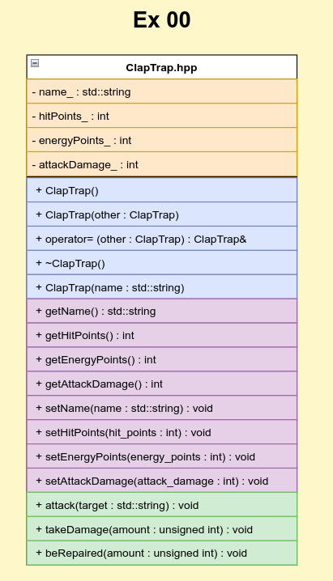
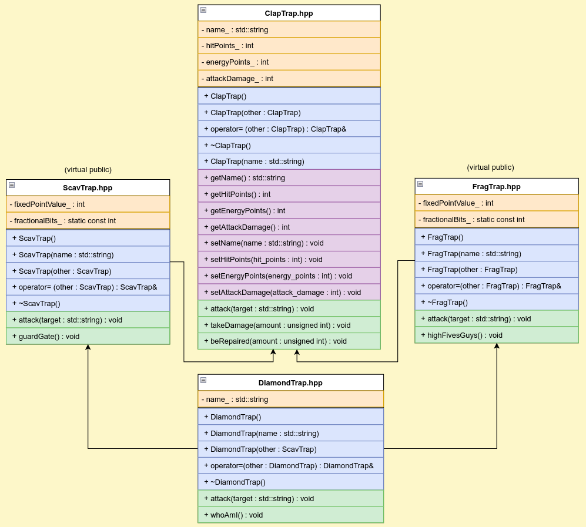

# 🧬 C++ Module 03 - Inheritance

This module introduces inheritance concepts in C++, including single inheritance, multiple inheritance, virtual inheritance, and the diamond problem. Students will learn to design class hierarchies and understand the relationships between base and derived classes.

## 🎯 Learning Objectives

- Understand inheritance concepts and terminology
- Master single inheritance implementation
- Learn about virtual functions and polymorphism
- Understand multiple inheritance and its challenges
- Solve the diamond problem with virtual inheritance
- Practice proper class hierarchy design

## 📁 Exercises Overview

### Exercise 00: ClapTrap Base Class
**Files**: `ClapTrap.hpp`, `ClapTrap.cpp`, `main.cpp`

Introduction to a base class that will be inherited by other classes in subsequent exercises.



**Key Concepts**:
- Base class design
- Member variables and functions
- Constructor and destructor
- Attack and damage mechanics
- Energy and hit point management

**Class Structure**:
```cpp
class ClapTrap {
private:
    std::string name_;
    int hitPoints_;
    int energyPoints_;
    int attackDamage_;

public:
    // Canonical form
    ClapTrap();
    ClapTrap(const ClapTrap& other);
    ClapTrap& operator=(const ClapTrap& other);
    ~ClapTrap();

    // Parameterized constructor
    ClapTrap(const std::string& name);

    // Getters and setters
    std::string getName() const;
    int getHitPoints() const;
    int getEnergyPoints() const;
    int getAttackDamage() const;

    // Combat methods
    void attack(const std::string& target);
    void takeDamage(unsigned int amount);
    void beRepaired(unsigned int amount);
};
```

**Learning Focus**:
- Base class design principles
- Member variable organization
- Method implementation
- Resource management

### Exercise 01: ScavTrap Inheritance
**Files**: `ClapTrap.hpp`, `ClapTrap.cpp`, `ScavTrap.hpp`, `ScavTrap.cpp`, `main.cpp`

Single inheritance implementation with ScavTrap inheriting from ClapTrap.

**Key Concepts**:
- Single inheritance syntax
- Constructor chaining
- Method overriding
- Access specifiers (public, protected, private)
- Derived class functionality

**Class Structure**:
```cpp
class ScavTrap : public ClapTrap {
public:
    // Canonical form
    ScavTrap();
    ScavTrap(const ScavTrap& other);
    ScavTrap& operator=(const ScavTrap& other);
    ~ScavTrap();

    // Parameterized constructor
    ScavTrap(const std::string& name);

    // Overridden methods
    void attack(const std::string& target);

    // New methods specific to ScavTrap
    void guardGate();
};
```

**Learning Focus**:
- Inheritance syntax (`: public BaseClass`)
- Constructor initialization lists
- Method overriding
- Access to base class members
- Derived class-specific functionality

### Exercise 02: FragTrap Inheritance
**Files**: `ClapTrap.hpp`, `ClapTrap.cpp`, `FragTrap.hpp`, `FragTrap.cpp`, `main.cpp`

Another single inheritance example with FragTrap inheriting from ClapTrap.

**Key Concepts**:
- Multiple derived classes from same base
- Different derived class behaviors
- Method specialization
- Class-specific attributes

**Class Structure**:
```cpp
class FragTrap : public ClapTrap {
public:
    // Canonical form
    FragTrap();
    FragTrap(const FragTrap& other);
    FragTrap& operator=(const FragTrap& other);
    ~FragTrap();

    // Parameterized constructor
    FragTrap(const std::string& name);

    // Overridden methods
    void attack(const std::string& target);

    // New methods specific to FragTrap
    void highFivesGuys();
};
```

**Learning Focus**:
- Multiple inheritance paths
- Class specialization
- Different derived class behaviors
- Inheritance hierarchy design

### Exercise 03: Diamond Problem (DiamondTrap)
**Files**: `ClapTrap.hpp`, `ClapTrap.cpp`, `ScavTrap.hpp`, `ScavTrap.cpp`, `FragTrap.hpp`, `FragTrap.cpp`, `DiamondTrap.hpp`, `DiamondTrap.cpp`, `main.cpp`

Multiple inheritance and virtual inheritance to solve the diamond problem.



**Key Concepts**:
- Multiple inheritance syntax
- Virtual inheritance
- Diamond problem resolution
- Virtual base classes
- Constructor initialization order
- Method resolution order

**Class Structure**:
```cpp
class DiamondTrap : public ScavTrap, public FragTrap {
private:
    std::string name_;

public:
    // Canonical form
    DiamondTrap();
    DiamondTrap(const DiamondTrap& other);
    DiamondTrap& operator=(const DiamondTrap& other);
    ~DiamondTrap();

    // Parameterized constructor
    DiamondTrap(const std::string& name);

    // New methods specific to DiamondTrap
    void whoAmI();
    void attack(const std::string& target);
};
```

**Diamond Problem Explanation**:
```
        ClapTrap
       /        \
   ScavTrap   FragTrap
       \        /
      DiamondTrap
```

**Issues Without Virtual Inheritance**:
- Ambiguous base class access
- Multiple copies of base class data
- Constructor initialization problems

**Solution with Virtual Inheritance**:
```cpp
class ScavTrap : virtual public ClapTrap { ... };
class FragTrap : virtual public ClapTrap { ... };
class DiamondTrap : public ScavTrap, public FragTrap { ... };
```

**Learning Focus**:
- Virtual inheritance syntax
- Diamond problem understanding
- Multiple inheritance challenges
- Constructor initialization in complex hierarchies
- Method resolution in multiple inheritance

## 🛠️ Technical Skills Developed

### Inheritance Concepts
- **Single Inheritance**: One base class, one derived class
- **Multiple Inheritance**: Multiple base classes
- **Virtual Inheritance**: Solving the diamond problem
- **Access Specifiers**: Public, protected, private inheritance

### Class Design
- **Base Class Design**: Designing for inheritance
- **Derived Class Implementation**: Extending base functionality
- **Method Overriding**: Replacing base class methods
- **Constructor Chaining**: Proper initialization order

### Advanced Inheritance
- **Virtual Functions**: Runtime polymorphism (preparation)
- **Abstract Classes**: Pure virtual functions
- **Interface Design**: Multiple inheritance for interfaces
- **Diamond Problem**: Complex inheritance scenarios

## 🚀 How to Use This Module

### Prerequisites
- Completion of C++ Module 02
- Understanding of classes and objects
- Familiarity with constructors and destructors

### Compilation
Each exercise has its own Makefile:
```bash
cd cpp_module_03/ex00
make
./claptrap

cd ../ex01
make
./scavtrap

cd ../ex02
make
./fragtrap

cd ../ex03
make
./diamondtrap
```

### Testing
- **Exercise 00**: Test ClapTrap basic functionality
- **Exercise 01**: Test ScavTrap inheritance and guardGate()
- **Exercise 02**: Test FragTrap inheritance and highFivesGuys()
- **Exercise 03**: Test DiamondTrap multiple inheritance and whoAmI()

## 📖 Key Takeaways

1. **Inheritance Syntax**: `class Derived : public Base`
2. **Constructor Chaining**: Derived constructors call base constructors
3. **Method Overriding**: Derived classes can override base methods
4. **Virtual Inheritance**: Solves the diamond problem
5. **Access Control**: Inheritance affects member access

## 🔍 Inheritance Concepts Explained

### Single Inheritance
```cpp
class Base {
    // Base class members
};

class Derived : public Base {
    // Derived class members
};
```

### Multiple Inheritance
```cpp
class Base1 { ... };
class Base2 { ... };

class Derived : public Base1, public Base2 {
    // Inherits from both Base1 and Base2
};
```

### Virtual Inheritance
```cpp
class Base { ... };
class Derived1 : virtual public Base { ... };
class Derived2 : virtual public Base { ... };
class Final : public Derived1, public Derived2 { ... };
```

## ⚠️ Common Pitfalls

- **Constructor Order**: Base constructors called before derived
- **Destructor Order**: Derived destructors called before base
- **Ambiguous Access**: Multiple inheritance without virtual inheritance
- **Slicing**: Assigning derived object to base object
- **Virtual Inheritance**: Forgetting virtual keyword

## 🔗 Related Concepts

- **Polymorphism**: Runtime method resolution
- **Virtual Functions**: Dynamic binding
- **Abstract Classes**: Pure virtual functions
- **Composition vs Inheritance**: Alternative design patterns

## 📚 Further Reading

- [C++ Inheritance](https://www.learncpp.com/cpp-tutorial/basic-inheritance-in-c/)
- [Multiple Inheritance](https://isocpp.org/wiki/faq/multiple-inheritance)
- [Virtual Inheritance](https://en.cppreference.com/w/cpp/language/derived_class)
- [Diamond Problem](https://en.wikipedia.org/wiki/Diamond_problem)

---

*This module provides essential knowledge for understanding inheritance hierarchies and designing object-oriented systems with proper class relationships.*
