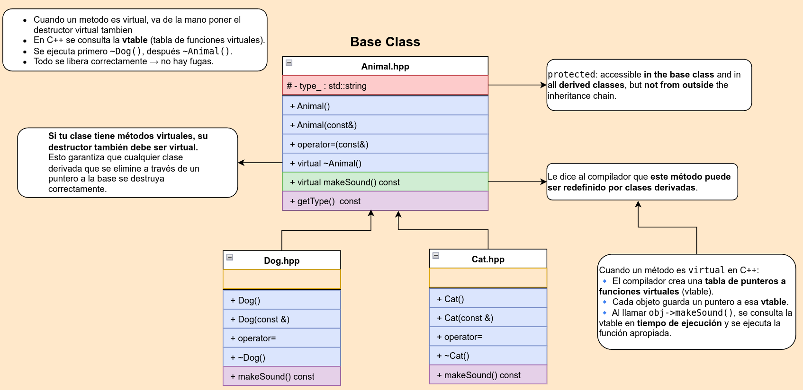
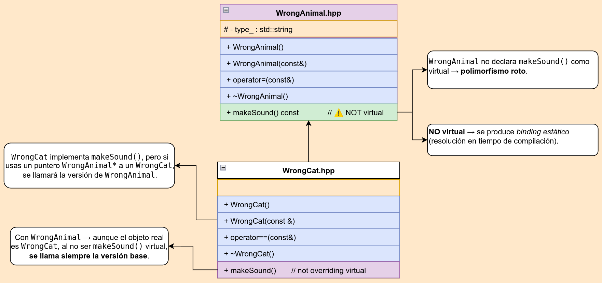
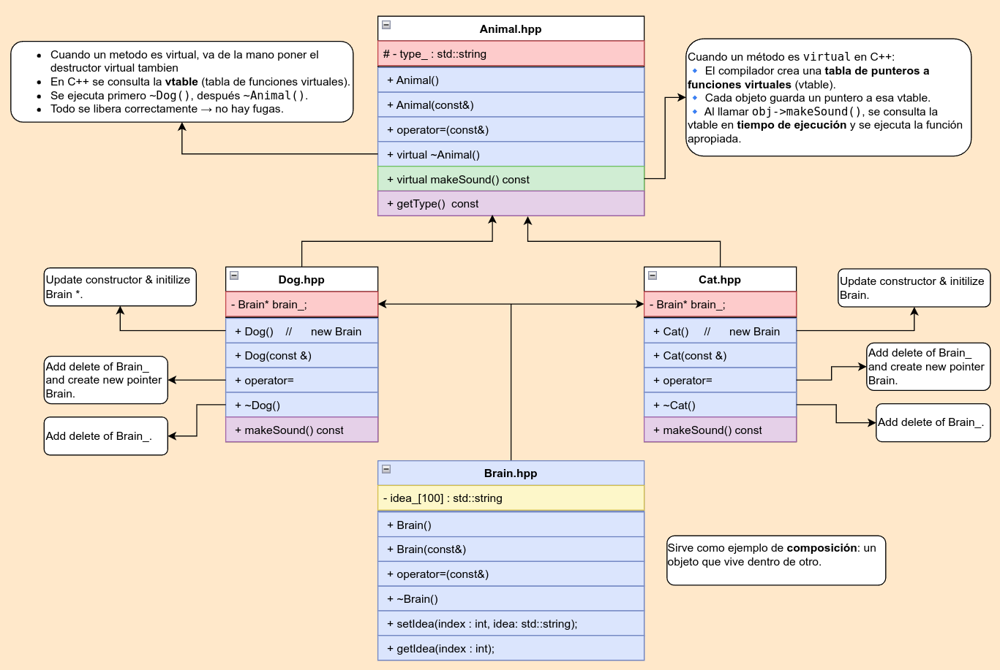
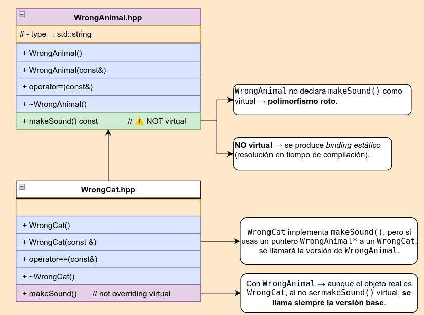
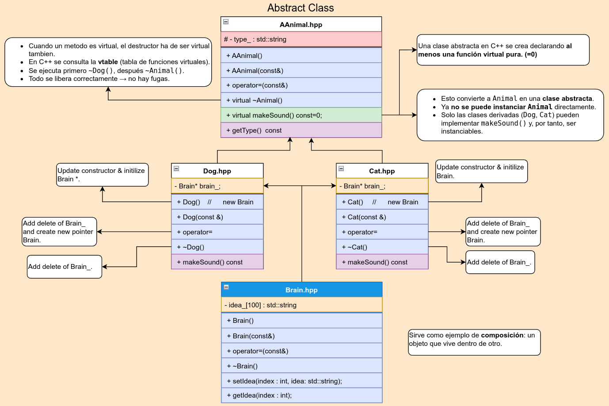
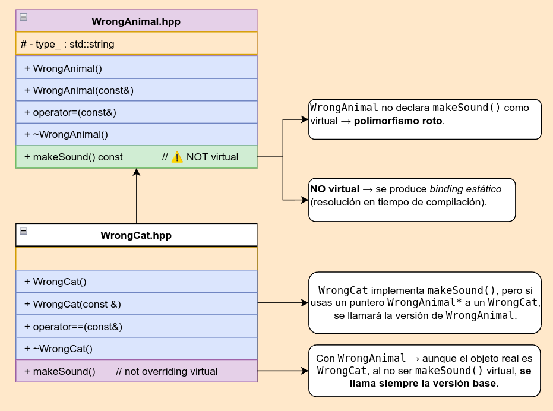
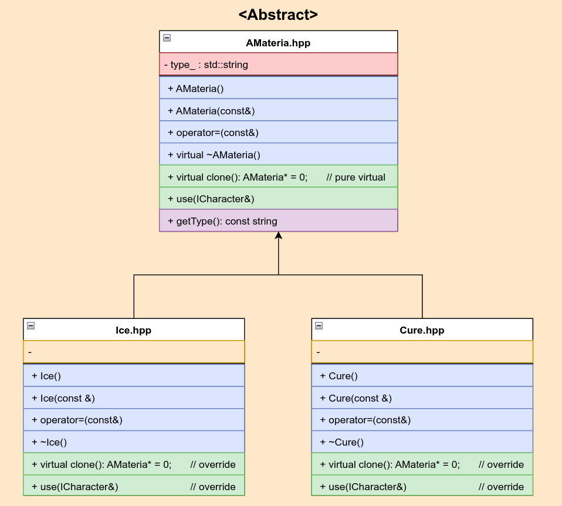
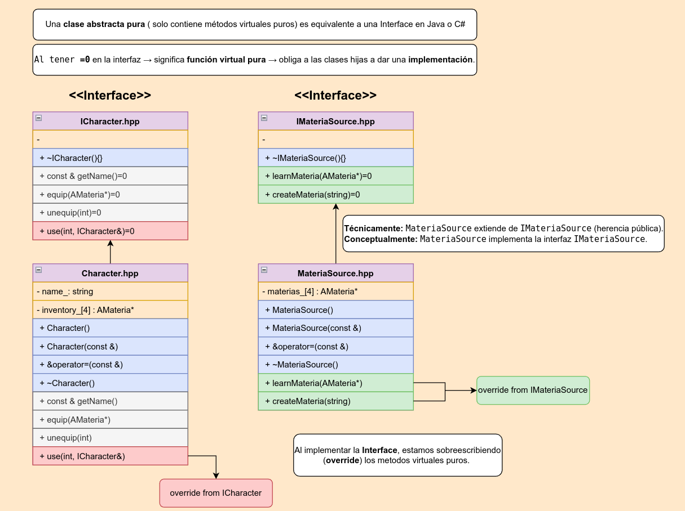

# 🎭 C++ Module 04 - Polymorphism

This module introduces polymorphism concepts in C++, including virtual functions, abstract classes, pure virtual functions, and virtual destructors. Students will learn to design polymorphic class hierarchies and understand runtime method resolution.

## 🎯 Learning Objectives

- Understand polymorphism and virtual functions
- Master abstract classes and pure virtual functions
- Learn about virtual destructors and their importance
- Understand runtime method resolution
- Practice with polymorphic class hierarchies
- Learn about interfaces and abstract base classes

## 📁 Exercises Overview

### Exercise 00: Animal Hierarchy
**Files**: `Animal.hpp`, `Animal.cpp`, `Cat.hpp`, `Cat.cpp`, `Dog.hpp`, `Dog.cpp`, `WrongAnimal.hpp`, `WrongCat.hpp`, `main.cpp`

Introduction to virtual functions and polymorphism with animal classes.





**Key Concepts**:
- Virtual functions
- Virtual destructors
- Method overriding
- Polymorphic behavior
- Wrong implementation (non-virtual) for comparison

**Class Structure**:
```cpp
class Animal {
protected:
    std::string type_;

public:
    Animal();
    Animal(const Animal& other);
    Animal& operator=(const Animal& other);
    virtual ~Animal();  // Virtual destructor

    virtual void makeSound() const;  // Virtual function
    std::string getType() const;
};

class Cat : public Animal {
public:
    Cat();
    Cat(const Cat& other);
    Cat& operator=(const Cat& other);
    ~Cat();

    void makeSound() const;  // Override virtual function
};

class Dog : public Animal {
public:
    Dog();
    Dog(const Dog& other);
    Dog& operator=(const Dog& other);
    ~Dog();

    void makeSound() const;  // Override virtual function
};
```

**Wrong Implementation (Non-Virtual)**:
```cpp
class WrongAnimal {
public:
    void makeSound() const;  // Non-virtual function
};

class WrongCat : public WrongAnimal {
public:
    void makeSound() const;  // Hides base function, doesn't override
};
```

**Learning Focus**:
- Virtual function declaration and implementation
- Virtual destructor necessity
- Polymorphic behavior demonstration
- Difference between virtual and non-virtual functions

### Exercise 01: Animal with Brain
**Files**: `Animal.hpp`, `Animal.cpp`, `Brain.hpp`, `Brain.cpp`, `Cat.hpp`, `Cat.cpp`, `Dog.hpp`, `Dog.cpp`, `WrongAnimal.hpp`, `WrongCat.hpp`, `main.cpp`

Extension of the animal hierarchy with brain functionality and deep copying.



[//]: # (width="600" height="380">)



[//]: # (width="600" height="380">)

**Key Concepts**:
- Composition (Animal has Brain)
- Deep copying
- Virtual destructors with composition
- Memory management in polymorphic hierarchies
- Copy constructors and assignment operators

**Class Structure**:
```cpp
class Brain {
private:
    std::string ideas_[100];

public:
    Brain();
    Brain(const Brain& other);
    Brain& operator=(const Brain& other);
    ~Brain();

    void setIdea(int index, const std::string& idea);
    std::string getIdea(int index) const;
};

class Animal {
protected:
    std::string type_;
    Brain* brain_;

public:
    Animal();
    Animal(const Animal& other);
    Animal& operator=(const Animal& other);
    virtual ~Animal();  // Virtual destructor for proper cleanup

    virtual void makeSound() const;
    std::string getType() const;
    Brain* getBrain() const;
};

class Cat : public Animal {
public:
    Cat();
    Cat(const Cat& other);
    Cat& operator=(const Cat& other);
    ~Cat();

    void makeSound() const;
};
```

**Learning Focus**:
- Composition in class hierarchies
- Deep copying with pointers
- Virtual destructor importance
- Memory management in polymorphic classes
- Proper cleanup of composed objects

### Exercise 02: Abstract Animal Class
**Files**: `AAnimal.hpp`, `Animal.cpp`, `Brain.hpp`, `Brain.cpp`, `Cat.hpp`, `Cat.cpp`, `Dog.hpp`, `Dog.cpp`, `WrongAnimal.hpp`, `WrongCat.hpp`, `main.cpp`

Introduction to abstract classes with pure virtual functions.



[//]: # (width="600" height="380">)



[//]: # (width="600" height="380">)

**Key Concepts**:
- Abstract classes
- Pure virtual functions
- Interface design
- Cannot instantiate abstract classes
- Must implement pure virtual functions in derived classes

**Class Structure**:
```cpp
class AAnimal {  // Abstract Animal
protected:
    std::string type_;
    Brain* brain_;

public:
    AAnimal();
    AAnimal(const AAnimal& other);
    AAnimal& operator=(const AAnimal& other);
    virtual ~AAnimal();

    virtual void makeSound() const = 0;  // Pure virtual function
    std::string getType() const;
    Brain* getBrain() const;
};

class Cat : public AAnimal {
public:
    Cat();
    Cat(const Cat& other);
    Cat& operator=(const Cat& other);
    ~Cat();

    void makeSound() const;  // Must implement pure virtual function
};
```

**Learning Focus**:
- Pure virtual function syntax (`= 0`)
- Abstract class concept
- Interface design patterns
- Forced implementation in derived classes
- Cannot instantiate abstract classes

### Exercise 03: Materia System
**Files**: `AMateria.hpp`, `AMateria.cpp`, `Ice.hpp`, `Ice.cpp`, `Cure.hpp`, `Cure.cpp`, `ICharacter.hpp`, `Character.hpp`, `Character.cpp`, `IMateriaSource.hpp`, `MateriaSource.hpp`, `MateriaSource.cpp`, `main.cpp`

Complex polymorphic system with abstract classes, interfaces, and multiple inheritance.



[//]: # (width="600" height="380">)



[//]: # (width="600" height="380">)

**Key Concepts**:
- Abstract base classes
- Interface classes
- Multiple inheritance
- Polymorphic containers
- Factory pattern
- Clone pattern

**Class Structure**:
```cpp
// Abstract base class for Materia
class AMateria {
protected:
    std::string type_;

public:
    AMateria();
    AMateria(std::string const &type);
    AMateria(const AMateria& other);
    AMateria& operator=(const AMateria& other);
    virtual ~AMateria();

    virtual AMateria* clone() const = 0;  // Pure virtual clone
    virtual void use(ICharacter& target);  // Virtual use function
    std::string const& getType() const;
};

// Concrete Materia implementations
class Ice : public AMateria {
public:
    Ice();
    Ice(const Ice& other);
    Ice& operator=(const Ice& other);
    ~Ice();

    AMateria* clone() const;  // Implement pure virtual
    void use(ICharacter& target);
};

class Cure : public AMateria {
public:
    Cure();
    Cure(const Cure& other);
    Cure& operator=(const Cure& other);
    ~Cure();

    AMateria* clone() const;  // Implement pure virtual
    void use(ICharacter& target);
};

// Interface for Character
class ICharacter {
public:
    virtual ~ICharacter() {}
    virtual std::string const& getName() const = 0;
    virtual void equip(AMateria* m) = 0;
    virtual void unequip(int idx) = 0;
    virtual void use(int idx, ICharacter& target) = 0;
};

// Concrete Character implementation
class Character : public ICharacter {
private:
    std::string name_;
    AMateria* inventory_[4];

public:
    Character();
    Character(std::string const &name);
    Character(const Character& other);
    Character& operator=(const Character& other);
    ~Character();

    std::string const& getName() const;
    void equip(AMateria* m);
    void unequip(int idx);
    void use(int idx, ICharacter& target);
};

// Interface for MateriaSource
class IMateriaSource {
public:
    virtual ~IMateriaSource() {}
    virtual void learnMateria(AMateria*) = 0;
    virtual AMateria* createMateria(std::string const &type) = 0;
};

// Concrete MateriaSource implementation
class MateriaSource : public IMateriaSource {
private:
    AMateria* learned_[4];

public:
    MateriaSource();
    MateriaSource(const MateriaSource& other);
    MateriaSource& operator=(const MateriaSource& other);
    ~MateriaSource();

    void learnMateria(AMateria* m);
    AMateria* createMateria(std::string const &type);
};
```

**Learning Focus**:
- Complex polymorphic hierarchies
- Interface design patterns
- Factory pattern implementation
- Clone pattern for object creation
- Multiple inheritance with interfaces
- Polymorphic containers and management

## 🛠️ Technical Skills Developed

### Polymorphism Concepts
- **Virtual Functions**: Runtime method resolution
- **Pure Virtual Functions**: Abstract method declaration
- **Virtual Destructors**: Proper cleanup in hierarchies
- **Abstract Classes**: Cannot be instantiated

### Advanced OOP Patterns
- **Interface Design**: Pure virtual function interfaces
- **Factory Pattern**: Object creation through interfaces
- **Clone Pattern**: Object duplication through virtual functions
- **Composition**: Objects containing other objects

### Memory Management
- **Virtual Destructors**: Ensuring proper cleanup
- **Deep Copying**: Copying composed objects
- **Polymorphic Containers**: Managing objects through base pointers
- **Resource Management**: Proper cleanup in complex hierarchies

## 🚀 How to Use This Module

### Prerequisites
- Completion of C++ Module 03
- Understanding of inheritance
- Familiarity with virtual functions

### Compilation
Each exercise has its own Makefile:
```bash
cd cpp_module_04/ex00
make
./animal

cd ../ex01
make
./animal

cd ../ex02
make
./animal

cd ../ex03
make
./materia
```

### Testing
- **Exercise 00**: Test polymorphic behavior with virtual functions
- **Exercise 01**: Test deep copying and memory management
- **Exercise 02**: Test abstract class behavior
- **Exercise 03**: Test complex polymorphic system

## 📖 Key Takeaways

1. **Virtual Functions**: Enable runtime polymorphism
2. **Pure Virtual Functions**: Create abstract classes
3. **Virtual Destructors**: Essential for proper cleanup
4. **Abstract Classes**: Define interfaces and contracts
5. **Polymorphic Design**: Write code that works with base classes

## 🔍 Polymorphism Concepts Explained

### Virtual Functions
```cpp
class Base {
public:
    virtual void func() { /* base implementation */ }
};

class Derived : public Base {
public:
    void func() { /* derived implementation */ }
};

Base* ptr = new Derived();
ptr->func();  // Calls Derived::func() at runtime
```

### Pure Virtual Functions
```cpp
class Abstract {
public:
    virtual void func() = 0;  // Pure virtual function
};

// Cannot instantiate Abstract
// Abstract obj;  // Compilation error
```

### Virtual Destructors
```cpp
class Base {
public:
    virtual ~Base() { /* base cleanup */ }
};

class Derived : public Base {
public:
    ~Derived() { /* derived cleanup */ }
};

Base* ptr = new Derived();
delete ptr;  // Calls Derived destructor, then Base destructor
```

## ⚠️ Common Pitfalls

- **Missing Virtual Destructors**: Memory leaks in hierarchies
- **Slicing**: Assigning derived objects to base objects
- **Pure Virtual Function Calls**: Calling pure virtual functions
- **Abstract Class Instantiation**: Trying to create abstract objects
- **Virtual Function Override**: Forgetting virtual keyword

## 🔗 Related Concepts

- **Runtime Polymorphism**: Dynamic method resolution
- **Static Polymorphism**: Template-based polymorphism
- **Interface Segregation**: Designing focused interfaces
- **Dependency Inversion**: Depending on abstractions

## 📚 Further Reading

- [Virtual Functions](https://isocpp.org/wiki/faq/virtual-functions)
- [Abstract Classes](https://en.cppreference.com/w/cpp/language/abstract_class)
- [Virtual Destructors](https://isocpp.org/wiki/faq/virtual-functions#virtual-dtors)

---

*This module provides essential knowledge for understanding polymorphism and designing flexible, extensible object-oriented systems.*
