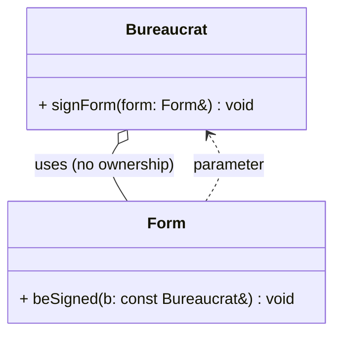
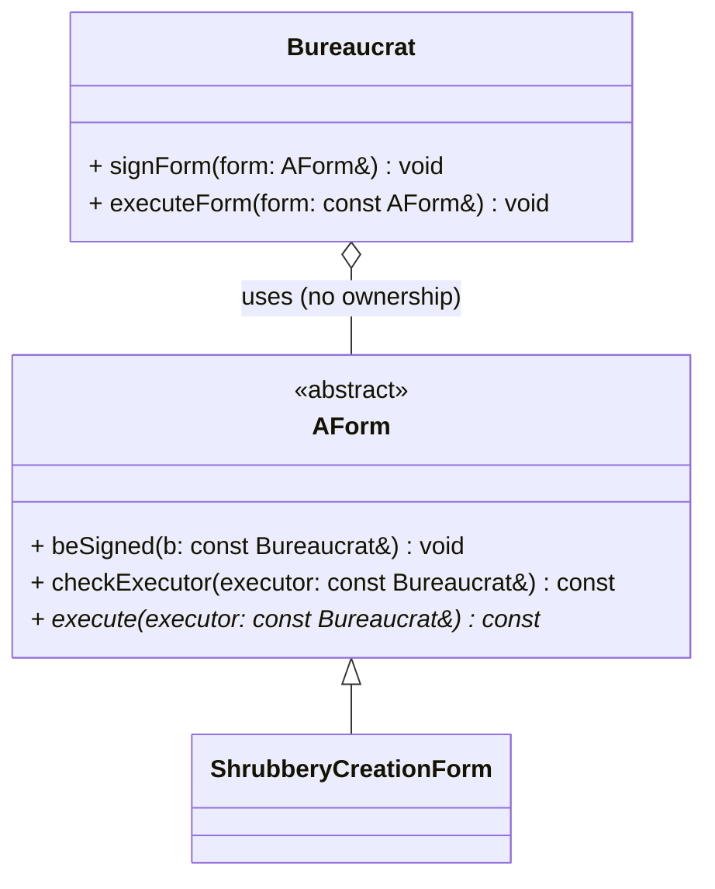
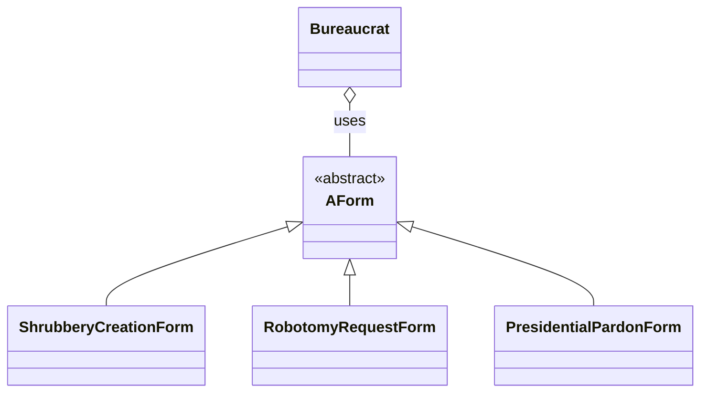

# Agregación vs Composición en Module 05 (ex01 y ex02)

Este documento explica, con el código de `ex01` y `ex02`, la diferencia entre agregación y composición, y cómo se manifiestan (o no) en estas soluciones.

## Conceptos rápidos

- **Agregación (has-a débil)**: 
  - Una clase **A** usa u obtiene referencias a objetos **B** creados/gestionados fuera de A. A no controla su vida.
  - **Si A desaparece, B puede seguir existiendo**.
- **Composición (has-a fuerte)**: 
  - Una clase A _posee objetos B_ y __controla__ su ciclo de vida. Suele expresarse con miembros por valor u objetos dinámicos gestionados internamente. 
  - Si A desaparece, B también.
- **Asociación**:
  - Relación general de colaboración (A conoce B) sin propiedad.

## ex01 — Bureaucrat y Form

Relación en el código:
- `Bureaucrat::signForm(Form&)` recibe una referencia a `Form` externo; no lo almacena.
- `Form::beSigned(const Bureaucrat&)` recibe un `Bureaucrat` externo; no lo almacena.

Esto es **asociación/agregación** (uso sin propiedad). Ninguna clase es dueña de la otra.



Notas:
- No hay composición entre estas entidades en ex01.

## ex02 — Bureaucrat, AForm y derivados

Relación en el código:
- `Bureaucrat` firma/ejecuta a través de `signForm(AForm&)` y `executeForm(const AForm&)`.
- `AForm` define la interfaz; derivadas (p.ej., `ShrubberyCreationForm`) implementan `execute` y usan `checkExecutor()`.
- Ninguna clase guarda a la otra como miembro; colaboran por referencia/parámetro.

Esto sigue siendo **asociación/agregación** entre `Bureaucrat` y (A)Form.



¿Hay composición en ex02?
- No entre las entidades principales. `ShrubberyCreationForm` sí compone datos internos (por valor `std::string ktarget_`), pero no posee otras entidades del dominio.

## Guía práctica: cómo se ven

- Agregación
```cpp
// A coopera con B, pero B no vive dentro de A
void A::operateOn(B& external) {
    external.doSomething();
}
```

- Composición
```cpp
// A posee a B. Si A se destruye, B también.
class A {
private:
    B owned_;  // por valor
public:
    A(): owned_(/*...*/) {}
};
```

## Cuándo elegir
- **Agregación/Asociación**: cuando tu clase solo interactúa con otra sin controlar su vida (como `Bureaucrat` con `Form/AForm`).
- **Composición**: cuando tu clase es responsable de construir, mantener y destruir el objeto contenido (buffers, recursos internos, etc.).

## Diagrama conjunto (ex02 extendido)



Resumen:
- En `ex01` y `ex02` predomina la **agregación/asociación** entre `Bureaucrat` y (A)Form.
- No hay **composición** entre las entidades principales; las derivadas componen solo datos internos.
