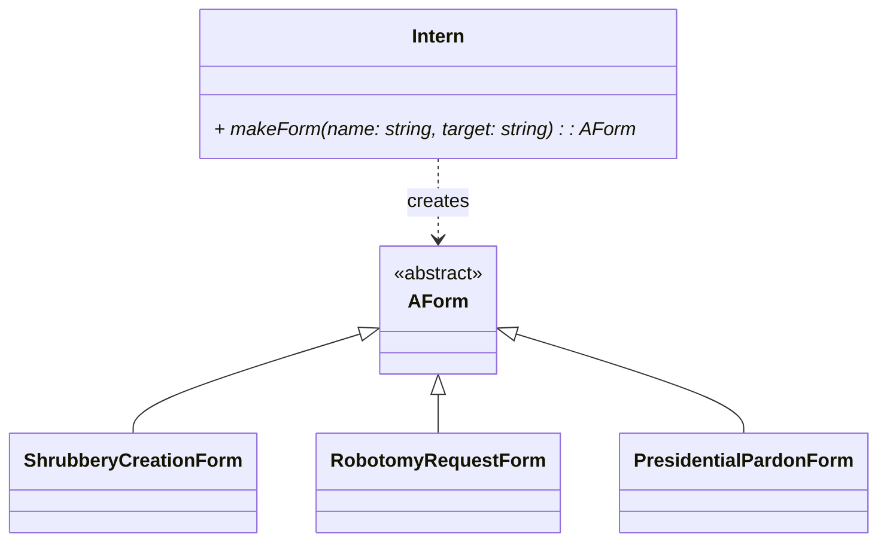
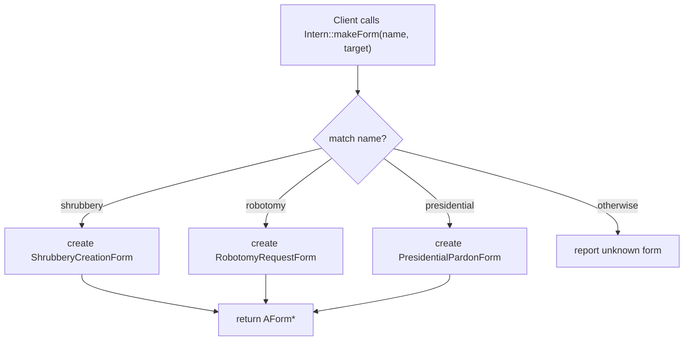

# C++ Module 05 - ex03: Factory (Simple Factory) aplicado a Formularios

Este ejercicio introduce una fábrica que crea instancias concretas de formularios a partir de un nombre textual. El objetivo es desacoplar al cliente de las clases concretas, trabajando siempre contra la interfaz común `AForm`.

## ¿Qué patrón usamos?

- **Factory / Simple Factory**: Una función u objeto "fábrica" recibe un identificador (string) y devuelve un objeto concreto que implementa una interfaz común. Aquí, `Intern::makeForm(name, target)` retorna `AForm*` creando internamente:
  - `ShrubberyCreationForm`
  - `RobotomyRequestForm`
  - `PresidentialPardonForm`

No es un "Factory Method" puro en el sentido GoF (no hay una clase base con un método de creación virtual para que herencias lo redefinan), sino una **fábrica centralizada** (Simple Factory) que decide qué clase instanciar.

## ¿Por qué es útil?

- **Desacopla**: El llamador no conoce ni incluye constructores concretos.
- **Extensible**: Para añadir un nuevo formulario, la fábrica puede mapear un nuevo nombre a una nueva clase.
- **Legible**: La lógica de elección está en un único lugar (`Intern`), no dispersa.

## Comparación con el problema (qué hacemos aquí)

- En el problema, el cliente pide: `makeForm("robotomy request", "Bender")` y recibe un `AForm*` ya construido de la clase adecuada.
- El cliente usa polimorfismo (`AForm`) para firmar/ejecutar sin saber si es `Shrubbery`, `Robotomy` o `Presidential`.
- Si el nombre no coincide, la fábrica informa el error (por ejemplo, lanza o retorna null) evitando que el cliente conozca detalles de construcción.

## Diagrama (Mermaid)



## Flujo de creación



## Ejemplo de uso (simplificado)

```cpp
Intern someRandomIntern;
AForm* form = someRandomIntern.makeForm("robotomy request", "Bender");
if (form) {
    Bureaucrat boss("Boss", 1);
    boss.signForm(*form);
    boss.executeForm(*form);
    delete form; // responsabilidad del llamador
}
```

## Buenas prácticas

- Centraliza el mapeo `string -> constructor` (p.ej., arrays de pares nombre/functor o if/else legible).
- Maneja nombres inválidos con mensajes claros o excepciones.
- Devuelve punteros/RAII (en C++98, `new` y `delete`; en moderno, smart pointers).
- Mantén la interfaz `AForm` estable para minimizar cambios en clientes.

---

En resumen, este ejercicio practica una **fábrica simple** que es suficiente para seleccionar entre varias implementaciones concretas de `AForm` basadas en un nombre, manteniendo el código cliente limpio y desacoplado.

