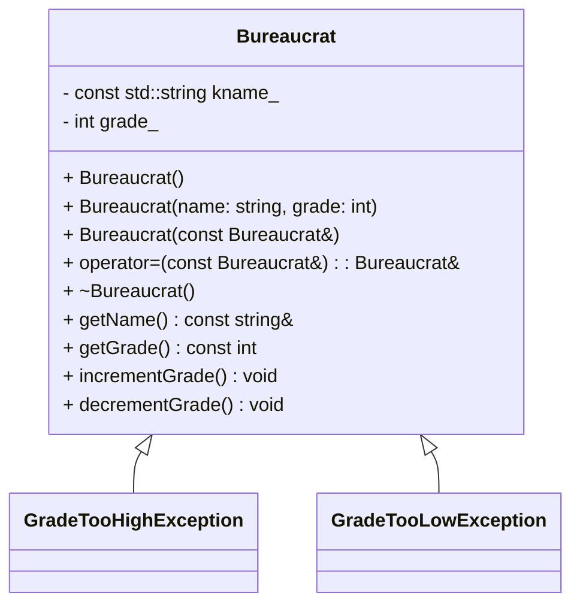
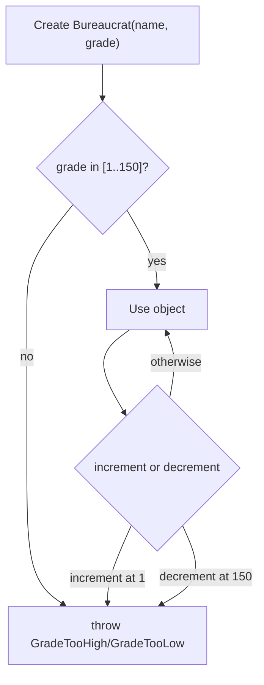

# C++ Module 05 - ex00: Bureaucrat

This exercise introduces the `Bureaucrat` class and exception handling for grade constraints. <br>
A bureaucrat has a constant name and a mutable grade within the inclusive range __[1..150]__ , where 1 is the highest rank and 150 the lowest.

## Learning Objectives

- Practice class design with invariants and encapsulation
- Implement and throw custom exceptions
- Use overload insertion operator (`operator<<`) for user-friendly output

## Class Overview



Notes:
- `grade_` must always be between 1 and 150.
- Incrementing a grade at 1 or decrementing at 150 must throw.

## Flowchart (Main Scenarios)




## Usage

Build and run:

``` bash

cd cpp_module_05/ex00
make
./bureaucrat
```

Expected behaviors demonstrated in `main.cpp`:
- Construction with valid/invalid grades
- Increment/decrement boundaries throwing exceptions
- Copy and assignment semantics

## Implementation Tips

- Validate grade in constructor; throw specific exception messages.
- Keep `kname_` immutable; only `grade_` changes.
- Make `what()` return clear, constant strings.
