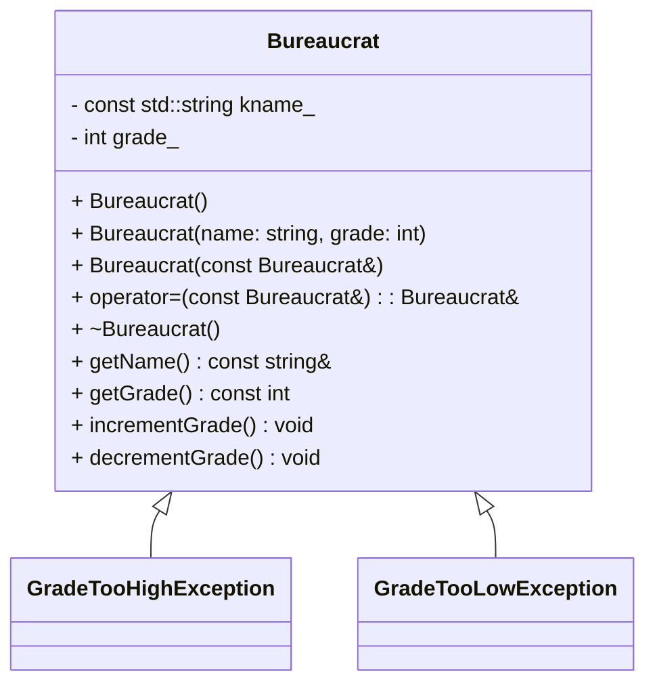

# C++ Module 05 - ex00: Bureaucrat

This exercise introduces the `Bureaucrat` class and exception handling for grade constraints. A bureaucrat has a constant name and a mutable grade within the inclusive range [1..150], where 1 is the highest rank and 150 the lowest.

## Learning Objectives

- Practice class design with invariants and encapsulation
- Implement and throw custom exceptions
- Overload insertion operator (`operator<<`) for user-friendly output
- Write precondition checks in constructors and mutators

## Class Overview



Notes:
- `grade_` must always be between 1 and 150.
- Incrementing a grade at 1 or decrementing at 150 must throw.

## Flowchart (Main Scenarios)

```mermaid
flowchart TD
  A[Create Bureaucrat(name, grade)] --> B{grade in [1..150]?}
  B -- no --> E[throw GradeTooHigh/Low]
  B -- yes --> C[Use object]
  C --> D{increment or decrement}
  D -- increment at 1 --> E
  D -- decrement at 150 --> E
  D -- otherwise --> C
```

## Usage

Build and run:

```bash
cd cpp_module_05/ex00
make
./bureaucrat
```

Expected behaviors demonstrated in `main.cpp`:
- Construction with valid/invalid grades
- Increment/decrement boundaries throwing exceptions
- Copy and assignment semantics

## Example Output

```
--- Test 1: Create with grade 150 and decrement ---
Exception caught: grade too low
... (other tests)
```

## Implementation Tips

- Validate grade in constructor; throw specific exception messages.
- Keep `kname_` immutable; only `grade_` changes.
- Make `what()` return clear, constant strings.


