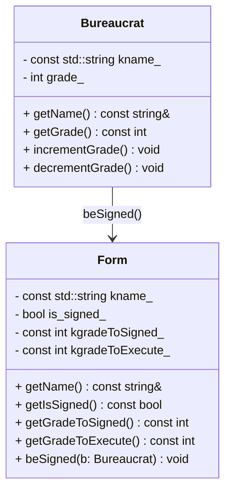

# C++ Module 05 - ex01: Form and Bureaucrat

This exercise extends ex00 by introducing a `Form` class which can be signed by
a `Bureaucrat` if the bureaucrat's grade is high enough. Both `Form` and
`Bureaucrat` enforce grade boundaries with exceptions.

## Learning Objectives

- Design collaborating classes with clear responsibilities
- Implement domain rules: sign and execute grade thresholds
- Use exceptions to protect class invariants
- Overload insertion operators for readable state printing

## Class Overview



Exceptions:

- `Bureaucrat::GradeTooHighException`, `Bureaucrat::GradeTooLowException`
- `Form::GradeTooHighException`, `Form::GradeTooLowException`

[//]: # (## Flowchart &#40;Signing a Form&#41;)

[//]: # ()
[//]: # (```mermaid)

[//]: # (flowchart TD)

[//]: # (  A[Create Form&#40;name, sGrade, eGrade&#41;] --> B{Grades in 1..150?})

[//]: # (  B -- no --> X[throw High/Low])

[//]: # (  B -- yes --> C[Create Bureaucrat&#40;name, grade&#41;])

[//]: # (  C --> D{bureaucrat.grade <= form.kgradeToSigned?})

[//]: # (  D -- yes --> E[form.is_signed_ = true])

[//]: # (  D -- no --> X[throw GradeTooLowException])

[//]: # (```)

## Usage

Build and run:

```bash
cd cpp_module_05/ex01
make
./forms
```

Scenarios covered in `main.cpp`:

- Invalid forms (sign/execute grade out of bounds)
- Successful signing with sufficient grade
- Signing failure with insufficient grade

## Example Output

```
--- Test 4: Bureaucrat with enough grade signs Form ---
After signing:
Form Contract, signed: true, signGrade: 50, executeGrade: 60
```

## Implementation Tips

- Validate both `kgradeToSigned_` and `kgradeToExecute_` in constructors.
- `beSigned` must not change state if the check fails; throw instead.
- Keep `kname_` and grade thresholds constant after construction.


