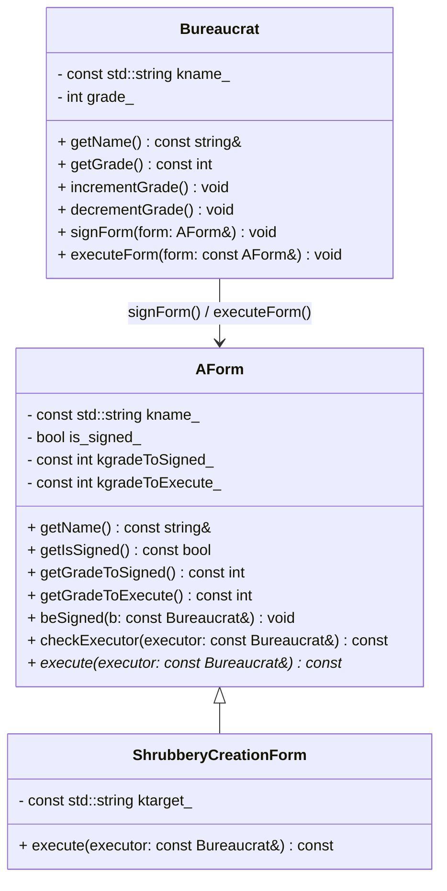
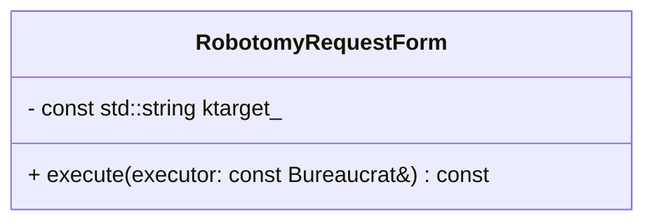
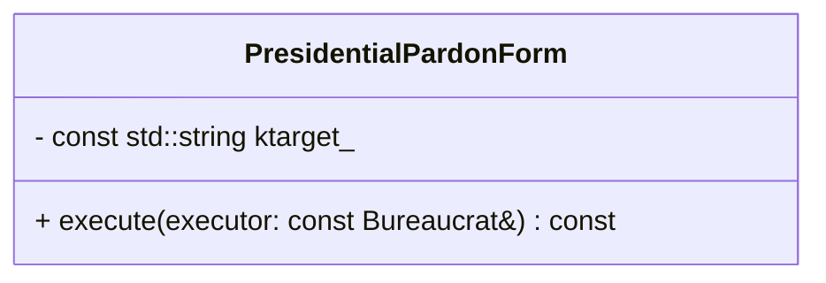
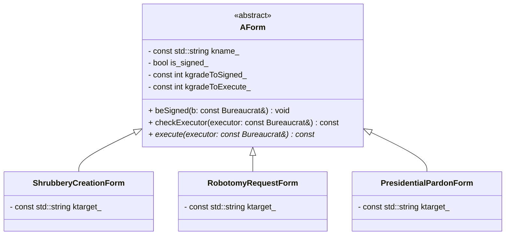

# C++ Module 05 - ex02: AForm hierarchy and execution

This exercise extends the forms system by introducing an abstract base class `AForm` with a pure virtual `execute()` and concrete derived forms. Here, `ShrubberyCreationForm` writes an ASCII tree to a file when executed.

## Learning Objectives

- Model an abstract hierarchy with a pure virtual operation
- Enforce invariants using exceptions and guard methods
- Collaborate between `Bureaucrat` and `AForm` for signing/executing
- Respect distinct grades for signing vs executing

## Class Overview



Notes:
- Grade range is 1..150 (1 is highest rank).
- `ShrubberyCreationForm` requires grades: sign 145, execute 137.
- `AForm::execute` is const and must be implemented by derived classes.
- `AForm::checkExecutor()` centralizes preconditions: must be signed and executor grade must be high enough; throws `FormNotSignedException` or `GradeTooLowException`.

## Flowchart (Execute path)

```mermaid
flowchart TD
  A[Bureaucrat calls executeForm(form)] --> B{call form.execute(this)}
  B --> C[Derived::execute(executor)]
  C --> D[form.checkExecutor(executor)]
  D -->|throws if not signed| X[FormNotSignedException]
  D -->|throws if grade too low| Y[GradeTooLowException]
  D -->|ok| E[ShrubberyCreationForm: open <target>_shrubbery]
  E --> F[write ASCII tree]
  F --> G[close file and report success]
```

## Usage

Build and run:

```bash
cd cpp_module_05/ex02
make
./no_you_need_form_28B,_not_28C...
```

The provided `main.cpp` demonstrates:
- Creating bureaucrats with different grades
- Signing and executing `ShrubberyCreationForm`
- Error handling for low-grade signer/executor and unsigned form

## Exceptions

- `Bureaucrat::GradeTooHighException`, `Bureaucrat::GradeTooLowException`
- `AForm::GradeTooHighException`, `AForm::GradeTooLowException`
- `AForm::FormNotSignedException`

## Implementation Tips

- Validate grade bounds in all constructors (throw high/low accordingly).
- Keep names/thresholds `const`; only `is_signed_` is mutable.
- Call `checkExecutor()` first thing inside each derived `execute()`.
- Prefer printing informative messages in `signForm`/`executeForm` try/catch blocks.

---

## RobotomyRequestForm (concept)

Behavior:
- Requires grades: sign 72, execute 45.
- On `execute`, performs a robotomy attempt on `target` with ~50% success (random).



Flowchart:

```mermaid
flowchart TD
  A[execute(executor)] --> B[checkExecutor(executor)]
  B -->|ok| C{random 50%}
  C -->|success| D["<target> has been robotomized successfully"]
  C -->|failure| E["robotomy failed"]
```

Notes:
- Use a pseudo-random generator with stable seeding if tests require determinism.
- Keep all precondition checks in `checkExecutor()`.

---

## PresidentialPardonForm (concept)

Behavior:
- Requires grades: sign 25, execute 5.
- On `execute`, prints that `target` has been pardoned by Zaphod Beeblebrox.



Flowchart:

```mermaid
flowchart TD
  A[execute(executor)] --> B[checkExecutor(executor)]
  B -->|ok| C[print "<target> has been pardoned by Zaphod Beeblebrox"]
```

Notes:
- No file I/O; only console output on success.
- Maintain the same exception semantics as other forms.

---

## Full Hierarchy Diagram




