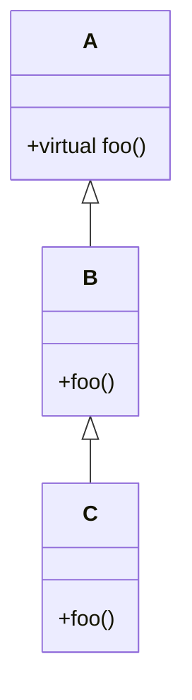

# Casting in C++98

## 🔹 Basic Concept

* A class that has **virtual functions** is called a **polymorphic class**.
* If `C` inherits from `B`, and `B` inherits from `A`, then an object of type `C` contains subobjects of both `B` and `A`.
* This means:

  * You can **upcast** (convert from `C*` to `B*` or `A*`) safely.
  * **Downcasting** (from `A*` or `B*` to `C*`) can be **unsafe** if the object is not actually of type `C`.

---

## 🔹 UML Hierarchy



📦 **Objects in memory**

When you create an instance of `C`, it internally contains:

```
[ A subobject ]
[ B subobject ]
[ C data      ]
```

* `A` is polymorphic because it defines virtual functions.
* `B` inherits from `A`.
* `C` inherits from `B`.

Therefore:

* A `C*` can always be converted to a `B*` or `A*` (upcast).
* A `B*` or `A*` does not necessarily point to a `C`, which is why `dynamic_cast` is needed for safe downcasting.

---

## 🔹 Upcast vs Downcast

* **Upcast (`C*` → `B*`)**
  Always safe, because a `C` contains a `B`.

  ```cpp
  C* pc = new C;
  B* pb = pc;  // correct (implicit upcast)
  ```

* **Downcast (`B*` → `C*`)**
  Potentially unsafe, because not every `B` is a `C`.

  ```cpp
  B* pb = new B;
  C* pc = (C*) pb;  // unsafe
  ```

---

## 🔹 Safe Downcasting

* Use **`dynamic_cast`** → performs a runtime check.

  * Returns `nullptr` if the conversion is not possible (when casting pointers).
  * Throws `std::bad_cast` if the conversion is invalid (when casting references).

  ```cpp
  B* pb = new C;  // actually points to a C
  C* pc = dynamic_cast<C*>(pb);
  if (pc) {
      std::cout << "Downcast successful" << std::endl;
  }
  ```

* Use **`static_cast`** → performs the conversion without runtime checks.

  * Faster, but **dangerous** if misused.
  * May lead to undefined behavior.

---

## 🔹 Design Advice

> It is better to avoid downcasting altogether.
> Instead, design your hierarchy with **virtual functions** so that the base class provides the correct behavior directly.

---

## 🔹 Comparison: `dynamic_cast` vs `static_cast`

| Feature              | `dynamic_cast`                                                                    | `static_cast`                                                       |
| -------------------- | --------------------------------------------------------------------------------- | ------------------------------------------------------------------- |
| **Runtime check**    | Yes (safe, verifies object type at runtime)                                     | No (assumes conversion is valid)                                  |
| **Performance**      | Slower (because of runtime check)                                                 | Faster (no check performed)                                         |
| **Failure behavior** | Returns `nullptr` (pointers) / throws `std::bad_cast` (references)                | Causes **undefined behavior** if invalid                            |
| **Usage**            | Safe downcasting in polymorphic hierarchies                                       | Upcasting, basic conversions, or when you are 100% sure of the type |
| **Requirement**      | Works only with **polymorphic classes** (must have at least one virtual function) | Works with any types                                                |
| **Best practice**    | Use when downcasting is necessary and type safety matters                         | Avoid for downcasts unless you are certain of the type              |

---


## Casting Operators

There are several casting operators specific to the C++ language. These operators are intended to remove some of the ambiguity and danger inherent in old style C language casts. These operators are:

- dynamic_cast Used for conversion of polymorphic types.

- static_cast Used for conversion of nonpolymorphic types.

- const_cast Used to remove the const, volatile, and __unaligned attributes.

- reinterpret_cast Used for simple reinterpretation of bits.

- safe_cast Used in C++/CLI to produce verifiable MSIL.

Use const_cast and reinterpret_cast as a last resort, since these operators present the same dangers as old style casts. However, they are still necessary in order to completely replace old style casts.


---

### 🔹 `dynamic_cast` Operator (C++98)

**Syntax**:

```cpp
dynamic_cast<type-id>(expression)
```

---

#### ✅ Rules

* `type-id` must be:

  * a **pointer** or **reference** to a class type with at least one virtual function (polymorphic class), or
  * a **pointer to void**.
* The type of `expression` must match:

  * a **pointer** if `type-id` is a pointer,
  * an **lvalue** if `type-id` is a reference.

---

#### ⚡ Behavior

* When using **pointers**:

  * If the cast succeeds → returns a valid pointer to the desired type.
  * If the cast fails → returns `0` (`nullptr` in modern C++).

* When using **references**:

  * If the cast succeeds → the reference is valid.
  * If the cast fails → throws a `std::bad_cast` exception.

---

#### 📝 Example

```cpp
#include <iostream>
#include <typeinfo>

struct Base { virtual ~Base() {} };
struct Derived : public Base {};

int main() {
    Base* b = new Derived;
    Derived* d1 = dynamic_cast<Derived*>(b);   // ✅ valid, returns pointer
    if (d1) std::cout << "Cast succeeded\n";

    Base* b2 = new Base;
    Derived* d2 = dynamic_cast<Derived*>(b2);  // ❌ invalid, returns 0
    if (!d2) std::cout << "Cast failed\n";

    try {
        Base& ref = *b2;
        Derived& refD = dynamic_cast<Derived&>(ref); // ❌ throws std::bad_cast
    }
    catch (const std::bad_cast& e) {
        std::cout << "Exception: " << e.what() << '\n';
    }

    delete b;
    delete b2;
}
```

---

**Summary**

* Use `dynamic_cast` for safe downcasting in polymorphic hierarchies.
* **Pointers** → return `0` if the cast fails.
* **References** → throw `std::bad_cast` if the cast fails.

---

# 🔹 `static_cast` in C++98

### Syntax

```cpp
static_cast<type-id>(expression)
```

---

### What it does

`static_cast` performs **compile-time conversions** between types.
It is checked by the compiler (no runtime check like `dynamic_cast`) and is **faster**, but can be unsafe if used incorrectly.

---

### 🔹 When to use `static_cast`

1. **Numeric conversions**
   Convert between arithmetic types (int, double, float, char, etc.).

   ```cpp
   int i = 42;
   double d = static_cast<double>(i);  // int → double
   char c = static_cast<char>(i);      // int → char
   ```

2. **Explicitly call a constructor**

   ```cpp
   double d = 3.14;
   int i = static_cast<int>(d);  // truncates to 3
   ```

3. **Upcasting in inheritance (derived → base)**
   This is always safe and often done implicitly.

   ```cpp
   struct Base { };
   struct Derived : Base { };

   Derived* d = new Derived();
   Base* b = static_cast<Base*>(d);  // safe upcast
   ```

4. **Downcasting in inheritance (base → derived)**
   Allowed by `static_cast`, but **dangerous** because no runtime check is performed.

   ```cpp
   Base* b = new Base();
   Derived* d = static_cast<Derived*>(b);  // ⚠️ compiles, but unsafe!
   ```

   👉 If you really need a downcast, use `dynamic_cast`.

5. **Remove `void*` ambiguity**

   ```cpp
   void* vp = new int(42);
   int* ip = static_cast<int*>(vp);  // valid cast
   ```

---

### 🔹 When **not** to use

* Never use it to cast between **unrelated pointers** (undefined behavior).
* Don’t use it for removing `const` — use `const_cast` instead.

---

### 📝 Example

```cpp
#include <iostream>

struct Base { virtual ~Base() {} };
struct Derived : public Base { void hello() { std::cout << "Hello from Derived\n"; } };

int main() {
    // Numeric conversion
    double pi = 3.14;
    int i = static_cast<int>(pi);  // 3
    std::cout << "pi as int: " << i << "\n";

    // Upcast (safe)
    Derived* d = new Derived();
    Base* b = static_cast<Base*>(d);

    // Downcast (unsafe with static_cast)
    Derived* d2 = static_cast<Derived*>(b);  // works, but not checked
    d2->hello(); // okay, because b actually points to a Derived

    Base* b2 = new Base();
    Derived* d3 = static_cast<Derived*>(b2);  // compiles but UB if used!
    // d3->hello(); // ⚠️ undefined behavior

    delete d;
    delete b2;
}
```

---

###  Summary

* **Checked at compile-time**, no runtime checks.
* Use for **safe conversions** (numeric types, upcasts, `void*`).
* Avoid for **downcasts** → use `dynamic_cast` instead.
* Faster than `dynamic_cast` but more dangerous.

---
