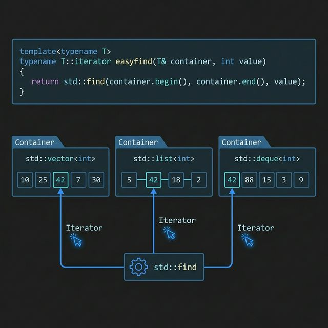
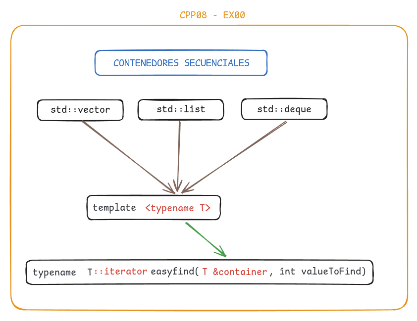
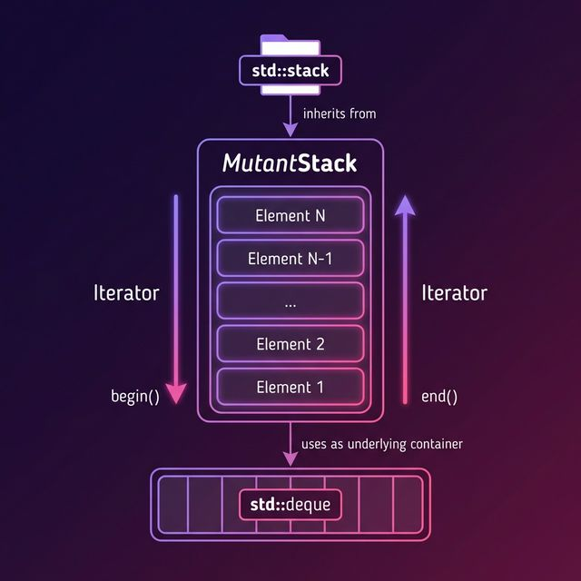
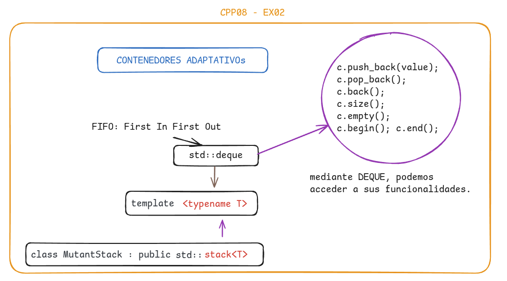

# C++ Module 08 - Templated Containers, Iterators and Algorithms

This module explores **STL containers**, **iterators**, and **algorithms** in C++98. The exercises demonstrate how to work with template functions, custom containers, and iterator patterns.

---

## Table of Contents

- [Exercise 00: Easy find](#exercise-00-easy-find)
- [Exercise 01: Span](#exercise-01-span)
- [Exercise 02: Mutated abomination](#exercise-02-mutated-abomination)
- [Compilation](#compilation)
- [Key Concepts](#key-concepts)

---

## Exercise 00: Easy find

**Objective:** Create a template function `easyfind` that finds the first occurrence of an integer in any STL container.

### Files
- `easyfind.hpp` - Template function implementation
- `main.cpp` - Test cases with vector, list, and deque

### Implementation

The `easyfind` function is a template that works with any container type:

```cpp
template <typename T>
typename T::iterator easyfind(T &container, int valueToFind)
{
    typename T::iterator it = std::find(container.begin(), container.end(), valueToFind);
    if (it == container.end())
        throw std::runtime_error("value not found in container");
    return it;
}
```

### How it works


<br>


The function uses `std::find` algorithm to search through any container that provides iterators. It works with:
- `std::vector<int>`
- `std::list<int>`
- `std::deque<int>`
- Any other container with `begin()` and `end()` iterators

### ✅ Usage Example

```cpp
std::vector<int> vec;
vec.push_back(30);
vec.push_back(50);
vec.push_back(70);

try {
    std::vector<int>::iterator it = easyfind(vec, 50);
    std::cout << "Found: " << *it << std::endl;
} catch (std::exception& e) {
    std::cerr << e.what() << std::endl;
}
```

### Test Cases
- ✓ Finding existing values in vector
- ✓ Finding existing values in list
- ✓ Finding existing values in deque
- ✓ Exception handling for non-existent values

---

## Exercise 01: Span

**Objective:** Create a `Span` class that stores N integers and can find the shortest and longest span (distance) between numbers.

### Files
- `Span.hpp` - Class declaration
- `Span.cpp` - Class implementation
- `main.cpp` - Test cases

### Implementation

The `Span` class provides:

```cpp
class Span {
private:
    unsigned int maxSize_;
    std::vector<int> numbers_;
    
public:
    Span(unsigned int n);
    void addNumber(unsigned int N);
    
    template<typename InputIterator>
    void addRangeOfNumbers(InputIterator begin, InputIterator end);
    
    unsigned int shortestSpan() const;
    unsigned int longestSpan() const;
};
```

### Key Features

1. **Single Number Addition**
   ```cpp
   Span sp(5);
   sp.addNumber(6);
   sp.addNumber(3);
   ```

2. **Range Addition** (using iterators)
   ```cpp
   std::vector<int> nums;
   // ... fill nums
   sp.addRangeOfNumbers(nums.begin(), nums.end());
   ```

3. **Shortest Span** - Finds minimum difference between consecutive sorted numbers
   - Sorts the container
   - Compares adjacent elements
   - Returns smallest difference

4. **Longest Span** - Finds difference between max and min values
   - Uses `std::max_element` and `std::min_element`
   - O(n) complexity

### Usage Example

```cpp
Span sp(5);
sp.addNumber(6);
sp.addNumber(3);
sp.addNumber(17);
sp.addNumber(9);
sp.addNumber(11);

std::cout << "Shortest span: " << sp.shortestSpan() << std::endl; // 2 (11-9)
std::cout << "Longest span: " << sp.longestSpan() << std::endl;   // 14 (17-3)
```

### Test Cases to implement:
- ✓ Adding single numbers
- ✓ Adding range of numbers using iterators
- ✓ Calculating shortest span
- ✓ Calculating longest span
- ✓ Exception handling for overflow
- ✓ Exception handling for insufficient elements

---

## Exercise 02: Mutated abomination

**Objective:** Create `MutantStack` - a stack container that supports iteration (normally, `std::stack` doesn't have iterators).

### Files
- `MutantStack.hpp` - Template class implementation
- `main.cpp` - Test cases comparing with `std::list`

### Implementation

```cpp
template <typename T>
class MutantStack : public std::stack<T>
{
public:
    typedef std::deque<T> tDeque;
    typedef typename tDeque::iterator iterator;
    typedef typename tDeque::const_iterator const_iterator;
    
    iterator begin() { return this->c.begin(); }
    iterator end() { return this->c.end(); }
    
    const_iterator begin() const { return this->c.begin(); }
    const_iterator end() const { return this->c.end(); }
};
```

### How it works


<br>


The `MutantStack` inherits from `std::stack` and exposes the underlying container (`c`, which is a `std::deque` by default) to provide iterator access. This allows:
- All standard stack operations (`push`, `pop`, `top`, `size`)
- **Plus** iterator-based traversal (`begin()`, `end()`)

### ✅ Usage Example

```cpp
MutantStack<int> mstack;
mstack.push(5);
mstack.push(17);
mstack.push(3);

// Standard stack operations
std::cout << "Top: " << mstack.top() << std::endl;
std::cout << "Size: " << mstack.size() << std::endl;

// Iterator traversal (not possible with std::stack!)
MutantStack<int>::iterator it = mstack.begin();
MutantStack<int>::iterator ite = mstack.end();

while (it != ite) {
    std::cout << *it << std::endl;
    ++it;
}
```

### Test Cases implemented 
- ✓ Basic stack operations (push, pop, top, size)
- ✓ Iterator traversal with integers
- ✓ Iterator traversal with doubles
- ✓ Comparison with `std::list` behavior
- ✓ Copy constructor and assignment operator

---

## Compilation

Each exercise has its own Makefile. To compile:

```bash
# Exercise 00
cd ex00 && make

# Exercise 01
cd ex01 && make

# Exercise 02
cd ex02 && make
```

All exercises compile with:
```bash
c++ -Wall -Wextra -Werror -std=c++98
```

---

## Key Concepts

### 🔹 Templates
- **Function templates** - `easyfind` works with any container type
- **Class templates** - `MutantStack` works with any data type
- **Member function templates** - `addRangeOfNumbers` accepts any iterator type

### 🔹 Iterators
- **Iterator types** - `iterator`, `const_iterator`
- **Iterator operations** - `begin()`, `end()`, increment, dereference
- **Iterator compatibility** - Works with all STL containers

### 🔹 STL Algorithms
- `std::find` - Linear search in containers
- `std::sort` - Sorting for span calculations
- `std::max_element` / `std::min_element` - Finding extremes

### 🔹 Container Adapters
- `std::stack` - LIFO container adapter
- Accessing underlying container (`c` member)
- Extending container adapters with new functionality

### 🔹 Exception Handling
- `std::runtime_error` - Value not found
- `std::overflow_error` - Container full
- `std::length_error` - Insufficient elements
- `std::out_of_range` - Index out of bounds

---

## 📖 Learning Outcomes

After completing this module, you will understand:

1. How to write **template functions** that work with any container
2. How to use **STL algorithms** (`find`, `sort`, `max_element`, `min_element`)
3. How **iterators** provide a uniform interface to containers
4. How to create **custom containers** with specific behaviors
5. How to extend **container adapters** (like `std::stack`)
6. The importance of **exception safety** in container operations
7. How to use **iterator ranges** for efficient bulk operations

---

**Author:** Daruuu  
**Module:** C++ Module 08  
**Standard:** C++98
