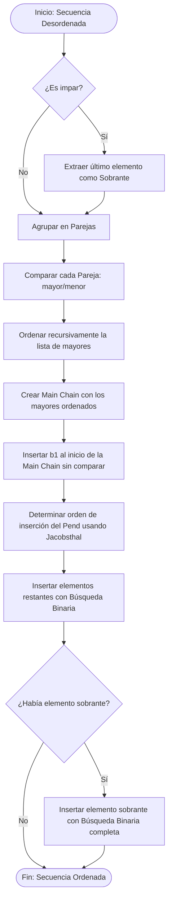

Ejemplo completo con una secuencia desordenada de **7 elementos** (un número impar, que es el caso más completo).

Secuencia inicial: `[12, 3, 9, 7, 2, 15, 6]`

---

### 📦 FASE 1: Emparejamiento y Comparación
Como el tamaño es impar (7), guardamos el último elemento como **Sobrante (Leftover)** y hacemos parejas con el resto.

*   **Sobrante:** `[6]`
*   **Parejas creadas y comparadas (Mayor > Menor):**
    *   `12 vs 3` $\rightarrow$ Pareja 1: `(12, 3)`
    *   `9 vs 7` $\rightarrow$ Pareja 2: `(9, 7)`
    *   `2 vs 15` $\rightarrow$ Pareja 3: `(15, 2)`

Visualmente, tenemos esta estructura:
```text
Mayores (A): [ 12,  9,  15 ]
                |   |    |    (Parejas vinculadas)
Menores (B): [  3,  7,   2 ]

Sobrante:    [  6 ]
```

---

### 🔄 FASE 2: Ordenación Recursiva de los Mayores
Llamamos al algoritmo para ordenar la lista de los mayores: `[12, 9, 15]`.
Una vez ordenada, **reorganizamos los menores** para que sigan vinculados a sus respectivas parejas.

*   Mayores ordenados: `[9, 12, 15]`
*   Menores reorganizados:
    *   La pareja de `9` es `7`.
    *   La pareja de `12` es `3`.
    *   La pareja de `15` es `2`.

Nuestra estructura ordenada queda así:
```text
Mayores (A) Ordenados:  [ 9,  12,  15 ]
                          |    |    |
Menores (B) Alineados:  [ 7,   3,   2 ]
```
*(Nota que ahora $b_1 = 7$, $b_2 = 3$, $b_3 = 2$)*

---

### 🎬 FASE 3: Inicialización de la Main Chain
Insertamos el primer elemento menor ($b_1 = 7$) al principio de la Main Chain de forma directa:

*   **Main Chain ($S$):** `[7, 9, 12, 15]` (Insertamos `7` al inicio de `[9, 12, 15]`)
*   **Elementos Pendientes en Pend ($P$):** `[3, 2]` *(correspondientes a b2 y b3)*
*   **Sobrante:** `[6]`

---

### 🗺️ FASE 4: Inserción de Jacobsthal
Tenemos dos elementos pendientes en el Pend: $b_2 = 3$ y $b_3 = 2$.
El número de Jacobsthal nos dice que el orden de inserción de este grupo es **inverso**: primero $b_3$ y luego $b_2$.

#### **Paso 4.1: Insertar $b_3$ (`2`)**
1.  **¿Quién es su pareja mayor?** Es `15`.
2.  **¿Dónde está el `15` en la Main Chain?**
    *   Main Chain actual: `[7, 9, 12, 15]` $\rightarrow$ El `15` está en el índice `3` (0-based).
3.  **Búsqueda Binaria**: Buscamos el lugar de `2` en el rango `[0, 3)` (es decir, dentro de `[7, 9, 12]`).
    *   El resultado nos dice que `2` va al inicio (índice 0).
4.  **Insertamos el `2`**:
    *   **Nueva Main Chain ($S$):** `[2, 7, 9, 12, 15]`

#### **Paso 4.2: Insertar $b_2$ (`3`)**
1.  **¿Quién es su pareja mayor?** Es `12`.
2.  **¿Dónde está el `12` en la Main Chain?**
    *   Main Chain actual: `[2, 7, 9, 12, 15]` $\rightarrow$ Ahora el `12` está en el índice `3`.
3.  **Búsqueda Binaria**: Buscamos el lugar de `3` en el rango `[0, 3)` (es decir, dentro de `[2, 7, 9]`).
    *   La búsqueda determina que `3` va entre `2` y `7` (índice 1).
4.  **Insertamos el `3`**:
    *   **Nueva Main Chain ($S$):** `[2, 3, 7, 9, 12, 15]`

---

### ⚠️ FASE 5: Inserción del Sobrante
El elemento sobrante (`6`) que guardamos al principio no tiene pareja. Por lo tanto, debemos buscar su posición en **toda** la Main Chain.

1.  **Búsqueda Binaria**: Buscamos el lugar de `6` en toda la Main Chain `[2, 3, 7, 9, 12, 15]`.
    *   La búsqueda determina que `6` va entre el `3` y el `7` (índice 2).
2.  **Insertamos el `6`**:
    *   **Main Chain ($S$) Final:** `[2, 3, 6, 7, 9, 12, 15]`

---

### 🎉 ¡Resultado Final Ordenado!
`[2, 3, 6, 7, 9, 12, 15]`

Al separar el sobrante al principio y reinsertarlo al final de todo, el algoritmo funciona perfectamente tanto para números de elementos pares como impares.

## 📊 Diagrama de Flujo del Algoritmo




### 💡 El Secreto de Jacobsthal en la Inserción
¿Por qué no insertamos en orden lineal ($b_2 \rightarrow b_3 \rightarrow b_4$)?
Porque al insertar un elemento, la Main Chain crece. Si insertas primero $b_3$, debido a la relación de tamaño conocida con su pareja $a_3$, el rango en el que buscas es menor de $2^k$, garantizando que el número de comparaciones de la búsqueda binaria sea matemáticamente el mínimo posible en el peor de los casos.

¿Te ayuda este flujo visual a estructurar el código en tu mente? Si quieres, podemos empezar a escribir la estructura del `PmergeMe.cpp` utilizando este mismo patrón paso a paso.