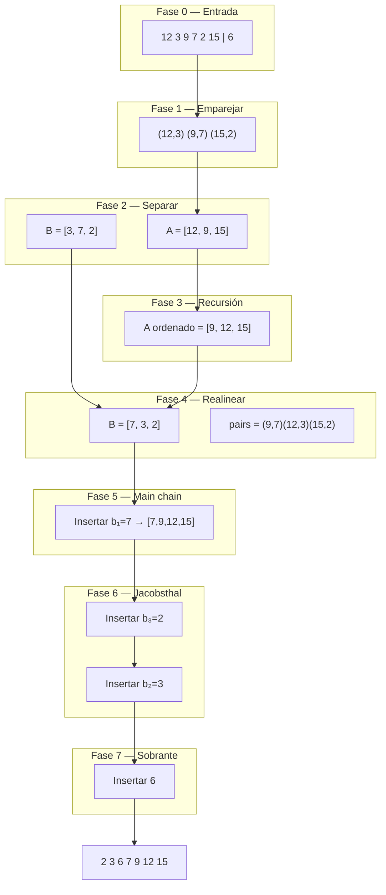

Te dejo el algoritmo **Ford–Johnson en `vector`** paso a paso, con un ejemplo concreto y diagramas. Encaja con tu `fordJohnsonVector`.

---

## Ejemplo: `12 3 9 7 2 15 6` (7 números, impar)

**Resultado final:** `2 3 6 7 9 12 15`

---

## Vista general (todas las fases)



---

## Fase 0 — Tamaño impar: guardar sobrante

```text
Entrada:  [12, 3, 9, 7, 2, 15, 6]
                              ↑
                         sobrante (pendingImpar = 6)

Trabajar con: [12, 3, 9, 7, 2, 15]   (6 elementos, par)
```

En código: `pendingImpar = 6`, `pop_back()`.

---

## Fase 1 — Emparejar y comparar (`createOrderedPairs`)

Comparas de **dos en dos**; en cada par guardas **mayor → `first`**, **menor → `second`**.

```text
 12 vs  3  →  (12, 3)
  9 vs  7  →  ( 9, 7)
  2 vs 15  →  (15, 2)

pairs = [ (12,3), (9,7), (15,2) ]
```

```text
   12 ──┬── 3        9 ──┬── 7       15 ──┬── 2
        │ mayor             │ mayor            │ mayor
        └ menor             └ menor            └ menor
```

---

## Fase 2 — Separar cadena A y cadena B

```text
        A (mayores)          B (menores)
        ───────────          ───────────
índice:   0    1    2          0   1   2
valor:   12    9   15          3   7   2
```

En código: `extractA` / `extractB`.

---

## Fase 3 — Ordenar solo A (recursión)

Llamas `fordJohnsonVector(ANumbers)` con `[12, 9, 15]`.

Esa recursión repite parejas → orden → inserción hasta dejar:

```text
ANumbers ordenado = [9, 12, 15]
```

`B` y `pairs` **aún** están en orden viejo:

```text
B viejo    = [3, 7, 2]
pairs viejo = (12,3) (9,7) (15,2)
```

---

## Fase 4 — Realinear B y `pairs` (`reorderBNumbersAndPairs`)

Para cada `a` en A **ya ordenado**, buscas su par y colocas el `b` alineado.

```text
  a =  9  →  par (9,7)   →  B[0] = 7
  a = 12  →  par (12,3)  →  B[1] = 3
  a = 15  →  par (15,2)  →  B[2] = 2

Después:
  A     = [ 9,  12,  15 ]
  B     = [ 7,   3,   2 ]
  pairs = [(9,7), (12,3), (15,2)]
```

```text
   A ordenado:  9 ─── 12 ─── 15
                │      │      │
   B alineado:  7      3      2
```

Sin este paso, el bucle Jacobsthal usaría el `b` equivocado.

---

## Fase 5 — Main chain + insertar b₁ sin comparar

```text
mainChain = A = [9, 12, 15]

Regla FJ: b₁ ≤ a₁ → insertar el primer B al inicio SIN comparar

mainChain = [7, 9, 12, 15]
             ↑
            b₁ (B[0])
```

En código: `mainChain.insert(begin, BNumbers[0])`.

Pendientes por insertar (índices 1-based): **b₂ = 3**, **b₃ = 2**.

---

## Fase 6 — Orden Jacobsthal + inserción acotada

### 6.1 Secuencia de Jacobsthal (hasta tamaño B = 3)

```text
J₀=0, J₁=1, J₂=3, J₃=5, ...

Jacobsthal:  0, 1, 3, 5, 11, ...
```

### 6.2 Orden de inserción (`getInsertionIndices`)

Para `B.size() == 3`, insertas en orden **1-based**: primero **3**, luego **2** (no el 1, ya está al inicio).

```text
insertionOrder = [3, 2]
                 │  │
                 │  └── insertar b₂ = 3
                 └───── insertar b₃ = 2
```

```text
Jacobsthal define "bloques" hacia atrás:
  ... → insertar hasta J=3 (b₃) → luego hasta J=1 (b₂)
```

---

### 6.3 Insertar **b₃ = 2** (primer paso del bucle)

| Dato | Valor |
|------|--------|
| `idx` | 3 |
| `valueToInsert` | `B[2]` = **2** |
| `targetNumLarger` | `pairs[2].first` = **15** |

```text
mainChain antes:  [7,  9,  12,  15]
                   0   1    2    3   ← índices

¿Dónde está 15? → posición 3
Buscar insertar 2 SOLO en [7, 9, 12]  (índices 0..2)

upper_bound(2 en [7,9,12]) → posición 0

mainChain después: [2, 7, 9, 12, 15]
```

```text
     límite ──────────────────┐
                              ▼
   [ 2 | 7 | 9 | 12 ]  | 15
     ↑ insertar aquí      ↑ a₃ (no buscar a la derecha)
```

---

### 6.4 Insertar **b₂ = 3** (segundo paso)

| Dato | Valor |
|------|--------|
| `idx` | 2 |
| `valueToInsert` | `B[1]` = **3** |
| `targetNumLarger` | `pairs[1].first` = **12** |

```text
mainChain antes:  [2,  7,  9,  12,  15]

¿Dónde está 12? → índice 3
Buscar 3 en [2, 7, 9]

upper_bound(3) → entre 2 y 7 → índice 1

mainChain después: [2, 3, 7, 9, 12, 15]
```

---

## Fase 7 — Insertar sobrante **6**

No tiene pareja; búsqueda en **toda** la cadena.

```text
mainChain: [2, 3, 7, 9, 12, 15]

upper_bound(6) → entre 3 y 7

RESULTADO FINAL: [2, 3, 6, 7, 9, 12, 15]
```

En código: `binarySearchInsertPos(begin, end, pendingImpar)`.

---

## Ejemplo corto del subject: `3 5 9 7 4`

```text
Fase 0   impar? no
Fase 1   (5,3) (9,7)
Fase 2   A=[5,9]  B=[3,7]
Fase 3   A ordenado = [5, 9]
Fase 4   B=[3,7]  pairs=(5,3)(9,7)   (ya alineado)
Fase 5   mainChain = [3, 5, 9]
Fase 6   B.size=2 → order [2] → insertar b₂=7 antes de 9
         mainChain = [3, 5, 7, 9]
Fase 7   sin sobrante
```

---

## Mapa: fase → tu función

| Fase visual | Función en tu código |
|-------------|----------------------|
| 0 Sobrante | `pendingImpar`, `pop_back` |
| 1 Parejas | `createOrderedPairs` |
| 2 A / B | `extractA`, `extractB` |
| 3 Ordenar A | `fordJohnsonVector(ANumbers)` |
| 4 Realinear | `reorderBNumbersAndPairs` |
| 5 b₁ al inicio | `insert(begin, B[0])` |
| 6 Jacobsthal | `createJacobsthalSequence` + `getInsertionIndices` |
| 6 Búsqueda | `find` + `binarySearchInsertPos` |
| 7 Sobrante | `binarySearchInsertPos` en `[begin, end)` |

---

## Recursión (qué pasa “dentro”)

Cuando ordenas `A = [12, 9, 15]`, la recursión hace lo mismo en miniatura:

```text
Nivel 1: [12,9,15]
    impar? no
    parejas: (12,9) → A'=[12], B'=[9]
    recursión A'=[12] → ya ordenado
    realinear, insertar B'[0]=9 → [9,12]
    insertar b₂=7? ... en realidad un solo B tras un par
    ...

Nivel 1 resulta: [9,12,15]
```

La recursión es **el mismo algoritmo** aplicado solo a los mayores, hasta `size <= 1`.

---

## Resumen en una imagen ASCII

```text
 ENTRADA (impar)
 [12 3 9 7 2 15] + sobrante [6]
        │
        ▼
 PAREJAS (mayor,menor)
 (12,3)(9,7)(15,2)
        │
   A ───┴─── B
 [12,9,15] [3,7,2]
        │
   ordenar A (recursivo)
        │
 [9,12,15] + realinear B → [7,3,2]
        │
 mainChain + b₁
 [7,9,12,15]
        │
 Jacob: insertar b₃=2, luego b₂=3
 [2,3,7,9,12,15]
        │
 sobrante 6
 [2,3,6,7,9,12,15] 
```

---
